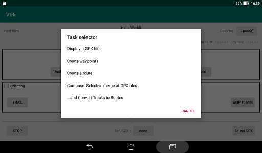

# Tasks and Actions

The Tasks menu at the start of the application and the menu for
the Actions button when a file has been selected are rather close.
They are documented here together with their differences.

* Display a GPX file.  
 This entry is specific to the Task menu. It lets you display
 a selected file.

For all the following entries a file has to be written at the
conclusion of the action. An appropriate permission to the
storage system is important.

* Rename xxx.  
 This entry is specific to the Action menu. It is only present
 if an element has the focus. xxx is the name of this element.  
 It lets you give a new name to this element. The name should
 contain only US-ASCII characters.  
 The current file is to be rewritten or a new file
 could be created.

All following entries are common to the two menus.  

The map displayed for the Task menu has the same settings
as for the last previous use without any marking.   
For the Actions menu the current file is first displayed
on the map before any picking.  
Note for the Actions menu: you need to Append to the current file
to combine the new elements with the previous content.  
Look at the [Picking](Picking.md) documentation for interaction with the map.

* Create waypoints.
* Create a route.

For the Actions menu the current file is the first concerned for the
next entries.

* Compose: Selective merge of GPX files.  
 This lets you assemble items from various GPX files as a new
 set in a new file or to replace an existing file. No map is displayed.   
 When a file to merge has been selected, a list of the items
 it contains is displayed. For each item there is an indication
 of its nature (WPT for waypoints, RTE for routes and TRK for tracks)
 and its name. Each item could be selected for inclusion
 in the merged set when the **PROCEED** button is used.  
   
 Then the next file could be processed or the storage phase
 could be started.  
 All items that have been merged are stored in a temporary file.
 A permanent file has to be selected with the common file module.  
 A button lets you select the first merged file as destination.
 Another **New** button is displayed if the right to write in the current
 directory is granted.  
 If the destination file already exists, you have to confirm that it
 could be overwritten and if an error occurs while writing the file you
 could select another destination.  
 At the end of the composition task the merged file is automatically
 selected for the display task.
 
* ...and Convert Tracks to Routes.  
This has the same function as the previous entry (Compose).  
However, any track is converted to a route. On the selection list
the prefix to track is changed to "!TRK" as warning.  
To reduce the number of locations along the track, they are pruned
to be distant of at least 50 meters.  
Hiking GPS have often some feature to guide along a route and the
purpose of this entry is to enable this feature.

 

 
