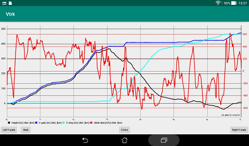
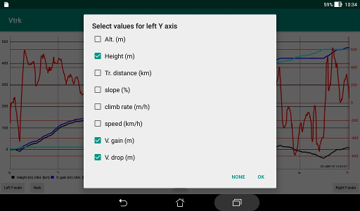

# Charting module

This module is reached with the button "Info" of the Display task
if the element that has the focus is a track.  
It is used to plot some parameters relative to the track
like an elevation profile or others.

The "Back" button returns to the Display task.

The setup of the chart is remembered with the preferences of the
application.

### General disposition

A number of parameters, some measured, some computed, are
plotted relative to the distance traveled or the time elapsed.  
The scales are automatically adjusted but zoom and pan are possibles.  
It is possible to have two scales for the Y axis: one is drawn on the
left and the other on the right. Each scale is shared by all parameters
that are linked to it.

### Colors

There is a legend that identify each curve by its color.  
For the left scale, each selected parameter is attributed sequentially
a color from the list: black, blue, cyan, magenta, green, yellow and red.  
For the right scale the order is reversed: red, yellow, green, magenta,
cyan, blue and black.

### Y axis

At the bottom left there is a button to let you select the parameters
sharing the left scale.  
And a button on the right for the right scale.

Parameters:

+ Altitude: this is the height (meters) above mean sea level
 as reported by the GPS. This provides the elevation profile if
 plotted versus the traveled distance.

+ Height: this is the height (meters) above the track starting location.  
 Could share the same scale as the vertical gain or drop.

+ Traveled distance: the sum of all distances (km) between successive
 locations. It is the projection on a horizontal surface.

+ Slope: the slope (%) computed from the difference of altitude
 of successive locations and their distance.  
 This is smoothed.

+ Climb rate: the vertical speed (meter per hour) computed from
 the time and height differences between successive locations.  
 This is smoothed.

+ Speed: the speed (km/h) on a horizontal projection computed from
 the time difference and the distance between successive locations.  
 This is smoothed.

+ Vertical gain: the summation of all previous gains of altitude (meters).

+ Vertical drop: the summation of all previous losses of altitude (meters).
 This is expressed as a positive number.

### X axis

A button in the middle of the bottom lets you select the X axis:
traveled distance (km) or elapsed time (minutes).

