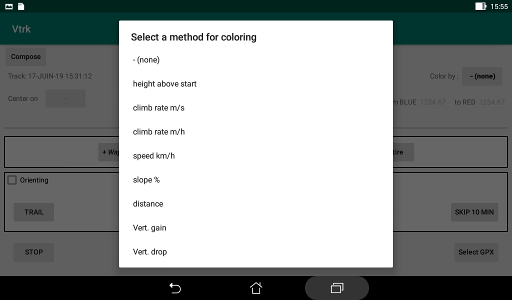

# Color scheme

The segments of line that draws the tracks could be colored in
function of some parameter value.  
The range of color goes from blue through green to red in 12 steps.  
A correspondence is established between the color range and the range
of the parameter. Some default range is proposed for each kind
of parameter but the user has the last word.  
If no color scheme is selected, the segment is red for an altitude
rising and blue for lowering altitude.

### Available parameters

+ "height above start" : height (m) relative to the first point
 of the track. Default range: -200 to 200.
+ "climb rate m/s" : vertical speed, more appropriate to an
 R/C model or a glider. Default range: -2.0 to 2.0.
+ "climb rate m/h" : vertical speed, appropriate for hiking.
 Default range: -400.0 to 400.0.
+ "speed km/h" : horizontal speed. Default range: 0.0 to 10.0.
+ "slope" : slope of the track. Default range: -40.0 to 40.0.
+ "distance" : accumulated traveled distance (km).
 Default range: 0.0 to 10.0.

These parameters are computed as needed.  
The speed is smoothed by computing it from points separated by
an interval of at least 10 seconds.  
The slope is smoothed by computing it on a difference of
altitude of at least 1 m.

### Routes

The default color for routes is the black color.  
They could be colored following the "distance" parameter.

If the altitude of each point of a route is specified, the route
could be colored with the "height above start" or the "slope" parameters.

The other parameters are not usable as there is no time
processed for the routes.

