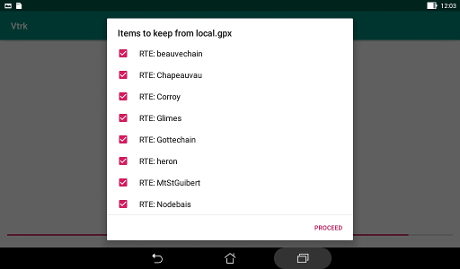

# Composition task

This lets you assemble items from various GPX files as a new
set in a new file or to replace an existing file.

When a file to merge has been selected, a list of the items
it contains is displayed. For each item there is an indication
of its nature (WPT for waypoints, RTE for routes and TRK for tracks)
and its name. Each item could be selected for inclusion
in the merged set when the **PROCEED** button is used.

Then the next file could be processed or the storage phase
could be started.

All items that have been merged are stored in a temporary file
and a permanent file has to be selected with the common file module.  
A button lets you select the first merged file as destination.
A **New** button is displayed if the right to write in the current
directory is granted.  
If the destination file already exists, you have to confirm that it
could be overwritten and if an error occurs while writing the file you
could select another destination.

At the end of the composition task the merged file is automatically
selected for the display task.

