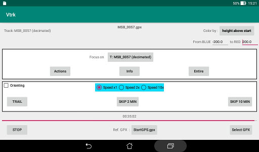
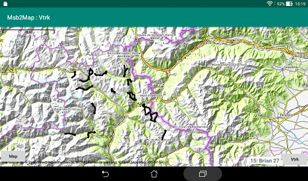
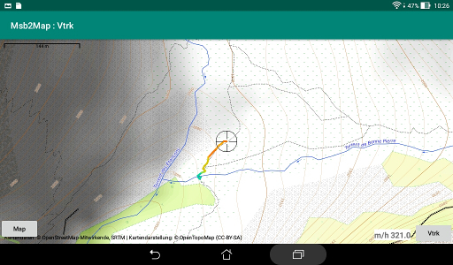

# Display task

There is a button to switch directly from this task to a composition
task using the current file as first merging candidate.

Waypoints, routes and tracks could be displayed.

Two modes of display are available for the tracks: "Entire" and "Vapor Trail".
The waypoints and routes are always displayed as for the "Entire" mode.

The "**+ Waypoint**" button and the "**+ Route**" button performs the
same function as the "**Entire**" button but, when the end of the file
is attained, they start a picking session respectively for waypoints
and for a route.

### "Entire" mode

The application sends the instructions to Msb2Map for waypoints, routes
and tracks starting from the beginning of the file as fast as
permitted by the processing speed.  
The map is centered on the first item to display.  
Processing of the file restarts from the beginning if it has
been interrupted by a return from Msb2Map.

+ Waypoints: each waypoint is displayed as a diabolo. The bubble that
 appears when it is touched shows the name and the altitude of the
 waypoint. The info field in the lower right of the map displays
 (until following item) the current number of waypoints.

+ Routes: a small black dot is displayed at the start location of each
 route and the line is initialized. The bubble that could be displayed
 for this marker shows the name of the route. 
 The info field shows the current number of routes.  
 Each line is displayed segment by segment with the
 selected color scheme. For each segment, the info field shows the
 minimum and maximum values until there for the parameter used
 for the color scheme.

+ Tracks: the tracks are displayed the same way as the routes.

### "Vapor trail" mode

If waypoints or routes are read from the file while in this mode,
they are displayed as in the "Entire" mode.  

The application sends the instructions to Msb2Map inserting
delays so that the tracks appears at a speed approximately equivalent to
the recording speed of travel or accelerated.

A small black dot is displayed at the start location of each
track. The head of the progressing track is shown with a reticle marker.  
Map is kept centered on this marker.  
The segments are vanishing when they are 20 steps back from the head.
See the documentation for the Msb2Map application.

The processing restart from the current position if has been
interrupted by a return from Msb2Map.

It is possible to skip some travel time of the track. The skip time
is applied once, to the current track or to the next track if no
current track.

The bubble that could be displayed for the marker at the start
contains the name of the track and
the info field at the lower right of the map shows the value of the
parameter used for the color scheme.

## Reference GPX

A button at the bottom of the screen lets you select another
GPX file.

This file could contain waypoints, routes and tracks. It is drawn first
at each invocation of Msb2Map, before the main file.  
The mode is equivalent to the "Entire" mode but the waypoints are
drawn as magenta colored diabolos, the routes and tracks are displayed
as lines with a uniform half-transparent magenta color.

This could be used, for example, to compare a track to a route
previously prepared.

