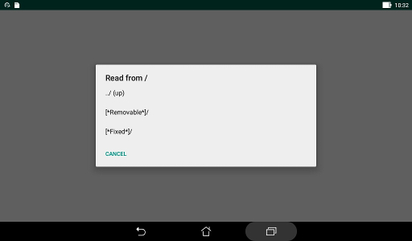

# File selection

The selection of the file to process is performed through an
internal module analog to a specialized  file explorer.
It allows the navigation in a hierarchy of directories.  

The content of the current directory is presented as a listing.
The first entry is labeled "**../  (up)**" and gives access to the
parent directory.  
And the next entries are the names of the sub directories padded
with a "/" character and allows the descent in the hierarchy.  
They are followed by the names of the files that could be selected.
Only GPX type files are shown.  
The entries are alphabetically ordered.

If there is a current file, a button is present with the name
(not the complete path) of this file between square brackets.
Touching this button select this file, irrelevant of the displayed
directory.

The initially shown directory is the one that has been
previously used with this application.

### Cancel

The "Cancel" button could be used to terminate the application.  

### Hierarchy roots

The Google Android system could present two roots for the hierarchy
of directories available to the application.  
The paths of the roots is virtualized in a way that is dependent
of the Android revision.

Internal storage should be always available and
the symbol **"[\*Fixed\*]"** is displayed instead of the real path,
for standardization.

Some removable media could be available: SD card, USB stick, cloud storage...  
If available, the access to this storage is through a special path
that is displayed as **"[\*Removable\*]"**.  
Writing access to this storage could be impossible for some
Android versions.

To switch from a root to the other, one has to rise in the hierarchy
of directories.

### Writing

If the application has been used to create new waypoints or a new route,
or to compose a new file,
the same module is used to allow the choice of a file to store
the new items.  
It is possible to overwrite or to append to the selected file if it
already exists.  
There is also a button "**New**" to let you create a new file in the
current directory.

