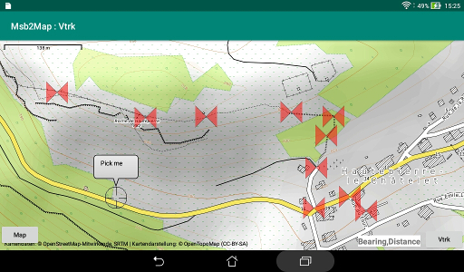

# Creation of new waypoints and routes

The Vtrk application could be used to create new waypoints or
new routes.  
After creation of some number of waypoints or one route, the new
items could be stored in a new GPX file or appended to an existing
file.

The creation is performed with a picking session through the Msb2Map
application. Please consult the documentation for this application.  
One has to drag a reticle marker to the appropriate location where
it appears as a butterfly marker. A name and optionally an altitude
are requested for each waypoint.  
The successive points of a route are
ordered but no name is needed. But at the return from Msb2Map a name is
needed for the route itself.

A picking session for waypoints or a picking session for a route
could be started as a combination with the display of a GPX file
in the "Entire" mode.  
Alternatively, if no file is selected to display,
it is possible to start an independent picking session.

A file to store the new items has to be selected at the return
from the picking session.  
A new file could be created in the current directory.  
Or an existing file could be selected: the content of
this file could then be completely overwrite or the new data could
be added near the end of the file.  
The currently displayed file could also be selected.  
An alternative file could be selected if there is an error: the file
or the directory could be write protected.

The removable storage is often not writable: see the "SAF" documentation
file.

The newly written file become the current file.

