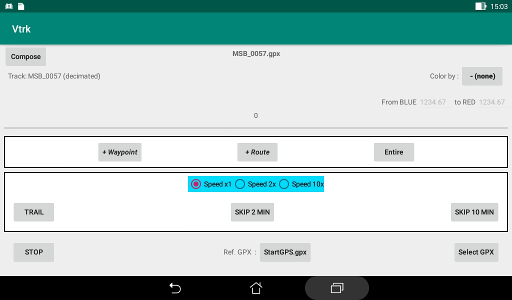
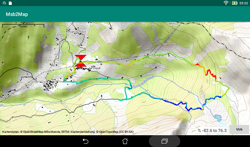
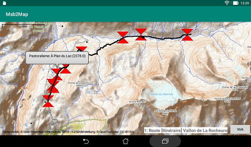

# Purpose
There are three tasks that could be performed by this application:

 + Draws on a topographic map background a mix of tracks,
routes and waypoints stored in a GPX file.
 + Create new routes and new waypoints.
 + Compose a GPX file from items extracted from other GPX files.

The map is displayed by the [Msb2Map](https://github.com/msb2kml/Msb2Map/)
application driven by Vtrk.  
The processed items are:

+ waypoints: latitude, longitude, altitude and name.
+ routes: name of the route and for each waypoint, the latitude and
 the longitude (eventually the altitude).
+ tracks: name of the track and for each waypoint, the latitude,
 the longitude, the altitude and the time.

Many hiking GPS and GPS applications for smartphones are recording compatible
files.  
This application is a spin off of the
[Msb2Kml](https://github.com/msb2kml/Msb2Kml/) application: the GPX
files that it produce are compatible too.

# Installation
The application should be compiled from the sources in this repository
or downloaded from the
[Releases](https://github.com/msb2kml/Vtrk/releases) pages.
The application package (such as
VtrkXX.apk) should be transferred to the storage of the device
(such as Downloads). Selecting it with a File manager should offer
the opportunity to install it.

The Msb2Map application should be independently installed.
Minimum version 1.6.

# Permissions
The Vtrk application needs to read the internal and the external storage.  
The Msb2Map application needs access to the Internet to fetch the
maps that are kept in a cache.

None of the applications need access to the location of the device.

# File selection
There is a built in specialized file manager that show, from the
content of a directory, only the sub-directories and the GPX files.
There is also an entry to move up in the hierarchy of directories.  
The last used directory is retained in the preferences.
Initially the internal storage is shown; it is possible to reach
the external storage by going up.

Vtrk register itself to the system as able to open GPX files: it could
be offered to open files of this type by applications such as a
file manager or a mailer.

# Processing
The elements waypoints, routes and tracks are drawn in the order
they are found when the file is read.

# Color of displayed tracks
The segments drawn between track points could be colored by the
value in a range of some parameter extracted or computed from
the track data.  
The range has to be defined and a correspondence is established
between the value of the parameter in this range and the color
from blue through green to red in 12 steps.  
The parameter could be:

+ "height above start" : height (m) relative to the first point
 of the track. Default range: -200 to 200.
+ "climb rate m/s" : Vertical speed, more appropriate to an
 R/C model or a glider. Default range: -2.0 to 2.0.
+ "climb rate m/h" : Vertical speed, appropriate for hiking.
 Default range: -400.0 to 400.0.
+ "speed km/h" : Horizontal speed. Default range: 0.0 to 10.0.
+ "slope %" : Slope of the track. Default range: -40.0 to 40.0.
+ "distance" : accumulated traveled distance (km).

Each speed is smoothed by computing them from
points separated by an interval of at least 10 seconds. 
The slope is smoothed on a difference of altitude of at least 1 m. 
If no parameter is selected, the segment is red if the altitude is
rising and blue if sinking.  
The routes are drawn in black.  

 

# Mode "Entire"
This is one of the two modes of display: the tracks or routes
are displayed in their entirety and statically.  
The information field at the bottom right of the Msb2Map screen
show the minimum and the maximum value encountered for the
parameter that has been used for the color (or the altitude).

# Mode "Vapor Trail"
This mode is only applicable to the tracks. If a route has to
be displayed, the "Entire" mode is applied.  
The tracks are drawn progressively as a vanishing vapor trail,
at a speed approximately equivalent to the recording speed.
This speed could be accelerated by a factor 2 or 10.  
It is possible to skip some parts initially of the first track
by blocks of 2 or 10 minutes.

The drawing could be suspended by returning to Vtrk from Msb2Map,
letting you change the color scheme, change the speed or skip
some portion and continuing from the point of suspension.  
Position in the progression is reset to the start
of the file when using the "Entire" mode.  
The information field of Msb2Map shows the current value of the
parameter that is used for the color (or the altitude).  
There is a marker with a form of reticle at the current
position: taping on this marker shows the current altitude.

# Waypoints
All waypoints are displayed, whatever the mode, as markers
with the form of a diabolo. Taping on a marker display the name
of the waypoint.  
A waypoint is generated at the start of each track or route and has
the name of its element.

# Reference GPX
Another GPX file could be displayed as a reference for the
subject file.  
This reference is drawn first, its waypoints, tracks and
routes are displayed with a uniform half-transparent magenta color.

