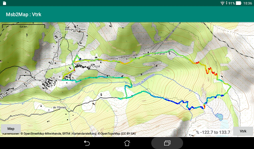

# Purpose
There are three tasks that could be performed by this application:

 + Draw on a topographic map background a mix of tracks,
routes and waypoints stored in a GPX file.
 + Create new routes and new waypoints.
 + Compose a GPX file from items extracted from other GPX files.  
 There is an option for this last task to transform all tracks to
 routes.

The map is displayed by the [Msb2Map](https://github.com/msb2kml/Msb2Map/)
application driven by Vtrk.  

Look for documentation here: [Documents](Documents/index.md).

Many hiking GPS and GPS applications for smartphones are recording compatible
files.  
This application is a spin off of the
[Msb2Kml](https://github.com/msb2kml/Msb2Kml/) application: the GPX
files that it produce are compatible too.

# Installation
The application should be compiled from the sources in this repository
or downloaded from the
[Releases](https://github.com/msb2kml/Vtrk/releases) pages.
The application package (such as
VtrkXX.apk) should be transferred to the storage of the device
(such as Downloads). Selecting it with a File manager should offer
the opportunity to install it.

The Msb2Map application should be independently installed.
Minimum version 1.7.

# Permissions
The Vtrk application needs to read the internal and the external storage.  
The Msb2Map application needs access to the Internet to fetch the
maps that are kept in a cache.

None of the applications need access to the location of the device.

